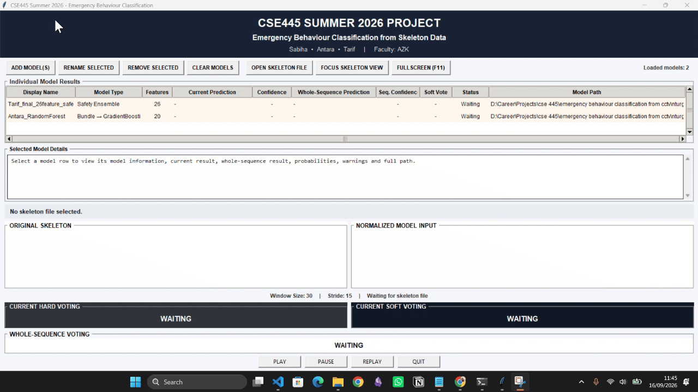
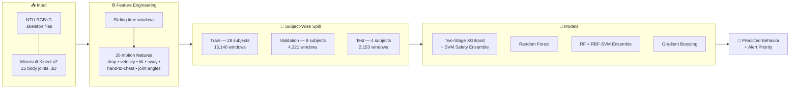
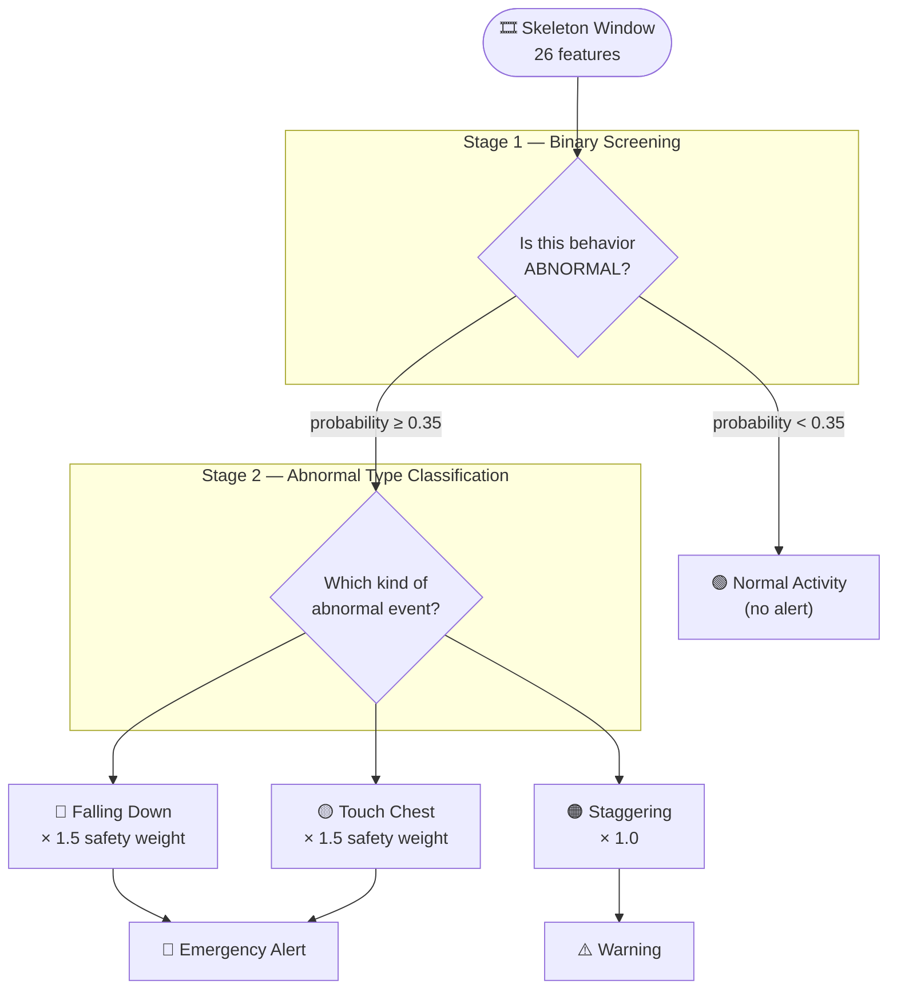
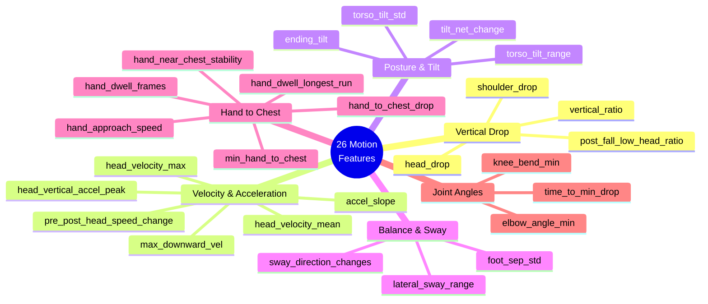
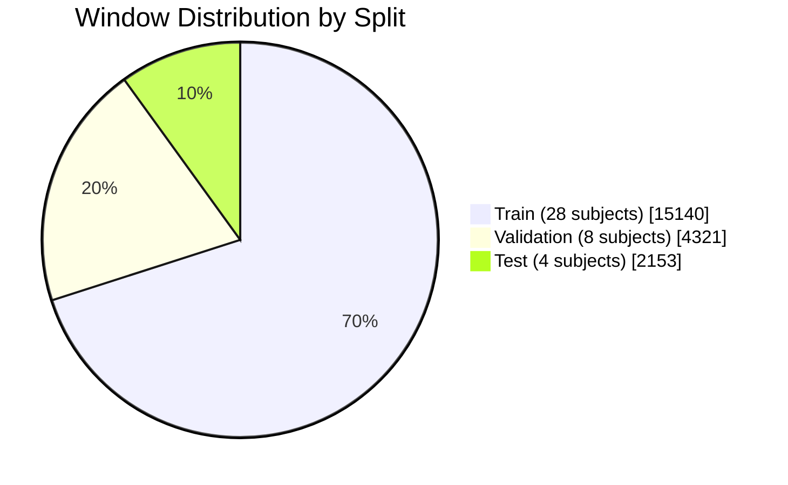
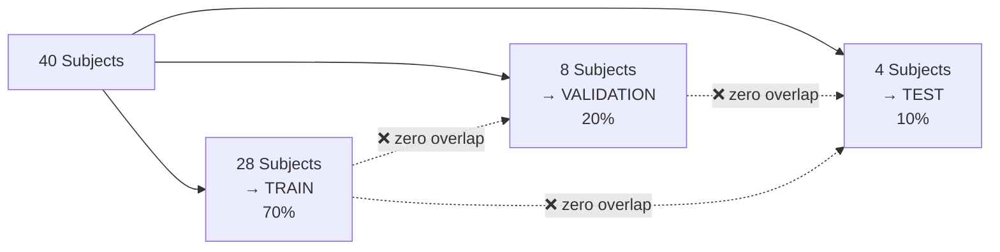
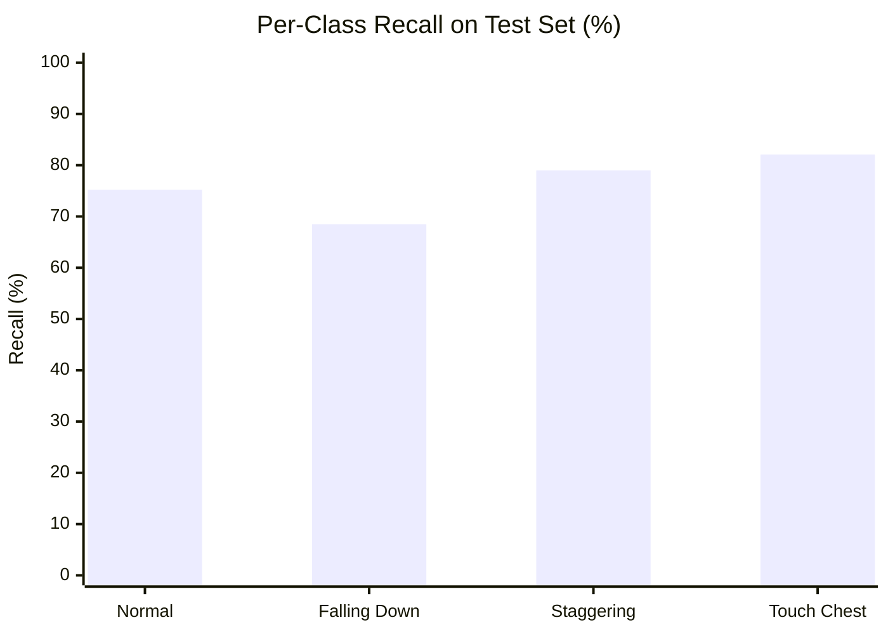
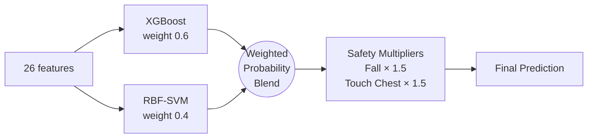
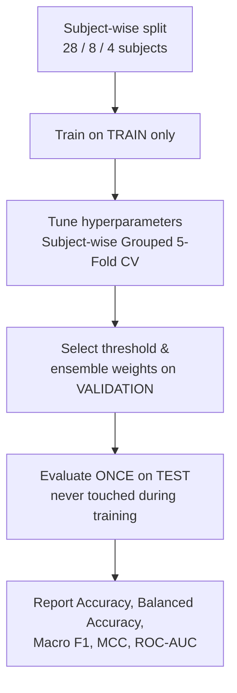

<div align="center">

# 🎥 Skeleton-Based Abnormal Human Behavior Detection

**Detecting falls, staggering, and chest-clutching from CCTV skeleton data — using classical machine learning, not deep learning.**


## 👥 Contributors

**Course:** CSE 445 — Machine Learning, Section 2
**Institution:** North South University (NSU), Bangladesh

| Name | Contribution |
|---|---|
| **Tarif Bin Mehedi** | Two-stage XGBoost pipeline, 26-feature engineering, safety ensemble, live MediaPipe demo |
| **Sabiha Binte Siraj** | RF + RBF-SVM ensemble, 20-feature model, probability calibration |
| **Antara** | Random Forest model, two-stage RF pipeline, baseline comparisons |
test_and_trial


</div>

---

## Overview

This project detects **medically important abnormal human behaviors** from CCTV footage using
only **skeleton joint coordinates** — no raw video pixels are needed at inference time.

Raw 3D skeleton sequences from the **NTU RGB+D** dataset (captured with Microsoft Kinect v2)
are converted into **26 hand-crafted motion features** describing how a person's body moves
over a short time window. Four different machine learning models are then trained to classify
each window into one of four behavior classes.

A key design goal was **safety-first detection**: in a real hospital or elderly-care setting,
missing a real fall is far more dangerous than raising a false alarm. The models are therefore
tuned toward **high recall on abnormal events**, even at the cost of some precision.

### Target Classes

| Class | Description | Why it matters |
|---|---|---|
| 🟢 **Normal Activity** | Ordinary everyday movement | Baseline / no alert |
| 🔴 **Falling Down** | Person collapses to the ground | Highest-priority medical emergency |
| 🟠 **Staggering / Unbalanced Movement** | Loss of balance, unsteady walking | Early warning sign of a fall |
| 🟡 **Touch Chest** | Hand held to chest | Possible cardiac distress |

---

## System Architecture



### Two-Stage Classification Pipeline

The flagship model splits the problem into two easier sub-problems instead of solving
one hard 4-class problem directly:



> **Why a low threshold (0.35) and safety multipliers?**
> Lowering the Stage-1 threshold pushes abnormal recall up to **87.7%**, and the ×1.5 decision
> multipliers on *Falling Down* and *Touch Chest* bias the final decision toward catching
> medical emergencies rather than staying "polite" about false alarms.

---

## Feature Engineering

All 26 features are computed per time window from 3D joint coordinates — no pixels involved.



**Feature versions:**
- **v1 — 20 base features** → used by the Random Forest + RBF-SVM ensemble
- **v2 — 26 features** (6 extra engineered features) → used by the two-stage XGBoost and Gradient Boosting models

The 6 additional v2 features (`post_fall_low_head_ratio`, `head_vertical_accel_peak`,
`pre_post_head_speed_change`, `hand_approach_speed`, `hand_dwell_longest_run`,
`hand_near_chest_stability`) were added specifically to separate *Falling Down* from
*Staggering*, and *Touch Chest* from ordinary hand movement.

---

## Dataset



**Total: 21,614 labeled windows from 40 subjects**

### Class Balance Across Splits

| Class | Train | Validation | Test |
|---|---:|---:|---:|
| Normal Activity | 7,185 | 2,060 | 1,030 |
| Staggering / Unbalanced | 3,684 | 1,052 | 510 |
| Touch Chest | 2,425 | 684 | 346 |
| Falling Down | 1,846 | 525 | 267 |
| **TOTAL** | **15,140** | **4,321** | **2,153** |

### Subject-Wise Splitting (No Data Leakage)



This is the most important methodological choice in the project. Splitting **by subject**
(not by random row) guarantees that the same person never appears in two splits. A random
split would let the model memorize individual body shapes and movement habits, producing
inflated scores that collapse on real, unseen people.

All cross-validation during tuning also used **subject-wise grouped 5-fold CV** for the same reason.

---

## Results

### Final Test Set Performance (4 completely unseen subjects)

| Model | Accuracy | Balanced Acc. | Macro F1 | MCC | Macro ROC-AUC |
|---|---:|---:|---:|---:|---:|
| 🥇 **Two-Stage XGBoost + SVM (Safety Ensemble)** | **0.7641** | **0.7622** | **0.7426** | **0.6608** | **0.9360** |
| 🥈 RF + RBF-SVM Ensemble (20 features) | 0.7645 | 0.7461 | 0.7390 | 0.6550 | 0.9242 |
| 🥉 Random Forest (end-to-end) | 0.7469 | — | 0.7241 | — | — |

> The two-stage safety ensemble and the RF-SVM ensemble land within a hair of each other on
> raw accuracy, but the two-stage model wins on **balanced accuracy, macro F1, MCC, and ROC-AUC** —
> meaning it handles the rare, dangerous classes noticeably better.

### Per-Class Test Recall — Two-Stage Safety Ensemble



| Class | Precision | Recall | F1 |
|---|---:|---:|---:|
| Normal Activity | 0.838 | 0.752 | 0.793 |
| Falling Down | 0.625 | 0.685 | 0.654 |
| Staggering / Unbalanced | 0.828 | 0.790 | 0.808 |
| Touch Chest | 0.634 | 0.821 | 0.715 |

### Validation Performance by Stage

| Stage | Task | Accuracy | F1 / Macro F1 | ROC-AUC |
|---|---|---:|---:|---:|
| Stage 1 | Normal vs Abnormal (binary) | 0.8051 | 0.8249 | 0.8865 |
| Stage 2 | 3-class abnormal type | 0.8209 | 0.8124 | 0.9473 |

**Stage 1 tuning gain:** hyperparameter tuning lifted validation F1 from `0.7919` → `0.8249`
(+0.033) and MCC from `0.5671` → `0.6190` (+0.052).

### Threshold Trade-off (Stage 1)

Lowering the abnormal-detection threshold trades precision for life-saving recall:

| Threshold | Accuracy | Abnormal Recall | Falling Recall | False Negatives |
|---:|---:|---:|---:|---:|
| 0.20 | 0.7709 | 0.9363 | 0.9676 | 144 |
| 0.25 | 0.7878 | 0.9204 | 0.9505 | 180 |
| 0.30 | 0.7989 | 0.9009 | 0.9162 | 224 |
| **0.35** ✅ | **0.8051** | **0.8770** | **0.8838** | **278** |
| 0.40 | 0.8068 | 0.8518 | 0.8419 | 335 |

**0.35 was selected** as the best balance between overall accuracy and keeping missed falls low.

---

## Repository Structure

```
.
├── Dataset/
│   ├── features.csv                  # Full 20-feature dataset (21,614 windows)
│   ├── train_features.csv            # Train split — 15,140 windows, 28 subjects
│   ├── validation_features.csv       # Validation split — 4,321 windows, 8 subjects
│   ├── test_features.csv             # Test split — 2,153 windows, 4 subjects
│   ├── subject_split.csv             # Subject ID → split assignment
│   └── split_summary.csv             # Per-class split balance report
│
├── Notebook/
│   ├── 12_13_gradient_boosting_training.ipynb   # XGBoost / GB two-stage training + tuning
│   ├── random_forest_training.ipynb             # Random Forest two-stage pipeline
│   ├── RFSVM.ipynb                              # RF + RBF-SVM weighted ensemble
│   ├── live_mediapipe_two_stage_xgboost.ipynb   # 🎥 Live webcam demo via MediaPipe
│   ├── *_features_v2.csv                        # 26-feature (v2) dataset splits
│   ├── stage1_xgboost_26f_tuned_oof.csv         # Stage-1 out-of-fold predictions
│   └── microsoft_kinect_v2.png                  # Kinect v2 joint reference diagram
│
├── Models/
│   ├── Tarif_final_26feature_safety_ensemble.joblib   # 🥇 Final two-stage safety ensemble
│   ├── final_two_stage_xgboost_26f.joblib            # Two-stage XGBoost
│   ├── Sabiha_20_features_final_rbf_svm.joblib       # RF + RBF-SVM ensemble
│   └── Antara_RandomForest.joblib                    # Random Forest model
│
├── Documentations/
│   ├── CSE-445.2-Project-Idea-Presentation.pptx
│   ├── full_plan.pdf
│   └── exclude.txt                   # Corrupted/unusable NTU sample IDs
│
└── README.md
```

---

## Model Details

### 1. Two-Stage XGBoost + SVM Safety Ensemble 🥇



- **Ensemble weights:** XGBoost 60% / SVM 40%
- **Safety multipliers:** `Falling Down × 1.5`, `Touch Chest × 1.5`, others × 1.0
- **Stage-1 threshold:** 0.35

### 2. Random Forest + RBF-SVM Ensemble

| Component | Configuration |
|---|---|
| Random Forest | 300 trees, `max_depth=15`, `max_features=3`, `min_samples_leaf=2`, balanced class weights |
| RBF-SVM | `C=2.0`, `gamma='scale'`, StandardScaler, balanced class weights |
| Calibration | Sigmoid, 5-fold |
| Ensemble | RF 60% / SVM 40% |
| Features | 20 (v1) |

### 3. Gradient Boosting (Tuned)

Best parameters found via subject-wise grouped 5-fold `RandomizedSearchCV` (30 candidates × 5 folds):

```python
{'subsample': 0.7, 'n_estimators': 300, 'min_samples_leaf': 3,
 'max_depth': 4, 'learning_rate': 0.08}
```

---

## Getting Started

### Installation

```bash
pip install numpy pandas scikit-learn xgboost joblib matplotlib seaborn
pip install mediapipe opencv-python   # only needed for the live demo
```

### Load a trained model and predict

```python
import joblib
import pandas as pd

# Load the final safety ensemble
bundle = joblib.load("Models/Tarif_final_26feature_safety_ensemble.joblib")

# Load test data
test = pd.read_csv("Notebook/test_features_v2.csv")
X = test.drop(columns=["window_id", "filename", "subject_id", "action_code", "label"])

predictions = bundle.predict(X)
print(predictions[:10])
```

Skeleton Files:
https://drive.google.com/open?id=1CUZnBtYwifVXS21yVg62T-vrPVayso5H
https://drive.google.com/open?id=1tEbuaEqMxAV7dNc4fqu1O4M7mC6CJ50w

### Reproduce the training

Open the notebooks in order:

1. `random_forest_training.ipynb` — Random Forest baseline
2. `RFSVM.ipynb` — RF + RBF-SVM ensemble (20 features)
3. `12_13_gradient_boosting_training.ipynb` — Gradient Boosting & two-stage XGBoost (26 features)
4. `12_13_gradient_boosting_training.ipynb`"THE LAST CELL" — real-time webcam inference

### Run the live demo

```bash
jupyter notebook Notebook/12_13_gradient_boosting_training.ipynb
#THE LAST CELL
```

MediaPipe extracts pose landmarks from your webcam, the same 26 features are computed in a
rolling window, and the two-stage model predicts behavior in real time.

---

## Evaluation Methodology



**Metrics reported:** Accuracy, Balanced Accuracy, Macro Precision / Recall / F1, Weighted F1,
Matthews Correlation Coefficient (MCC), Cohen's Kappa, Log Loss, ROC-AUC, PR-AUC.

Macro F1 and MCC are treated as the headline numbers because the classes are imbalanced —
plain accuracy would be misleading when *Normal Activity* makes up ~48% of all windows.

---

## Limitations & Future Work

- **Falling Down remains the hardest class** (test F1 ≈ 0.65) — it is the rarest class and
  visually overlaps with severe staggering.
- **Test set uses only 4 subjects**, so per-class test numbers carry meaningful variance.
- **Skeleton quality is a hard ceiling.** Kinect v2 joint noise and occlusion propagate
  directly into the features; MediaPipe landmarks in the live demo are 2D-dominant and noisier
  than the Kinect ground truth used for training.
- **Single-person assumption.** The pipeline handles one tracked skeleton at a time.
- **Future directions:** temporal models (LSTM / Temporal CNN / ST-GCN), multi-person tracking,
  longer context windows, and domain adaptation from Kinect skeletons to MediaPipe landmarks.

---


## Dataset Credit

Skeleton data derived from the **NTU RGB+D Action Recognition Dataset**, captured using
**Microsoft Kinect v2** (25 joints per skeleton, 3D coordinates).

> Shahroudy, A., Liu, J., Ng, T.-T., & Wang, G. (2016).
> *NTU RGB+D: A Large Scale Dataset for 3D Human Activity Analysis.* CVPR 2016.

---

## License

This project is released for **academic and educational use** as part of CSE 445 coursework.
The underlying NTU RGB+D dataset remains subject to its original license terms.

<div align="center">

**Built for safety-critical behavior monitoring**

</div>